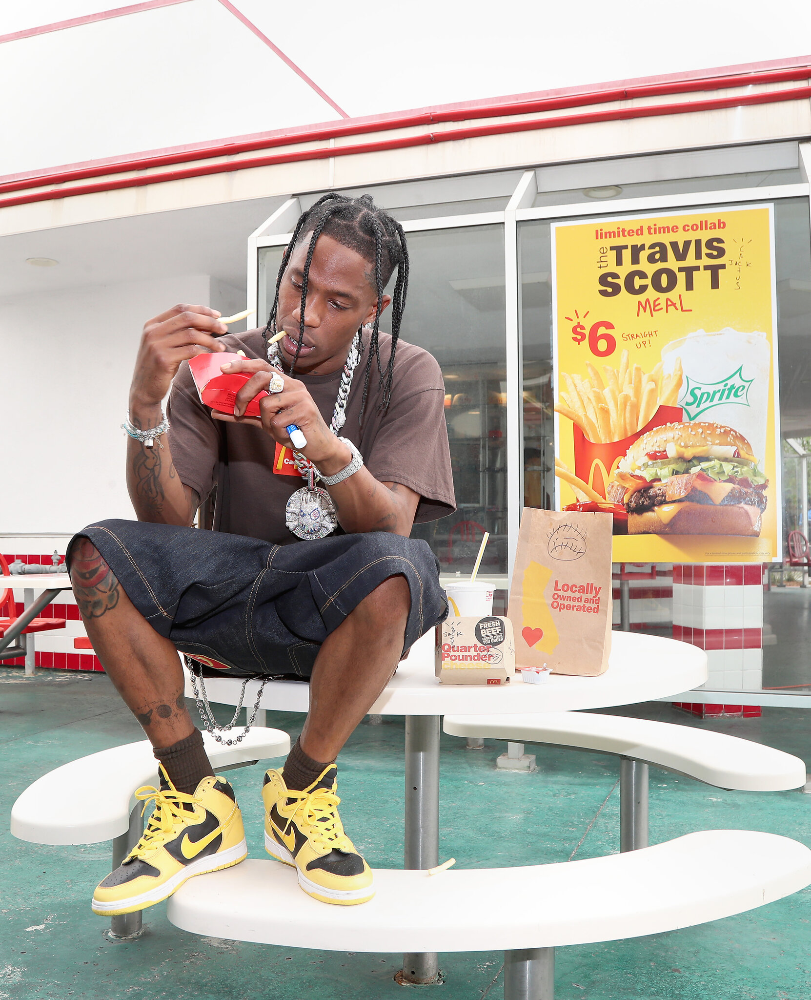

week-04-response.md
An example of an image that would be read differently if it were seen in another medium is an ad of Travis Scott eating a Travis Scott meal at Mcdonalds. The picture is a hot medium because it requires less sensory involvement of the person viewing the image. If it were a video of Travis eating the meal then it would be considered cold because the viewer would have to participate in watching it and it would require more attention. The three messages this picture contains are the poster in the background that has “Travis Scott Meal $6” on it (linguistic), the meal in Travis’ hand (denoted), and Travis himself eating the meal (symbolic, it must be good if he is eating it). 

